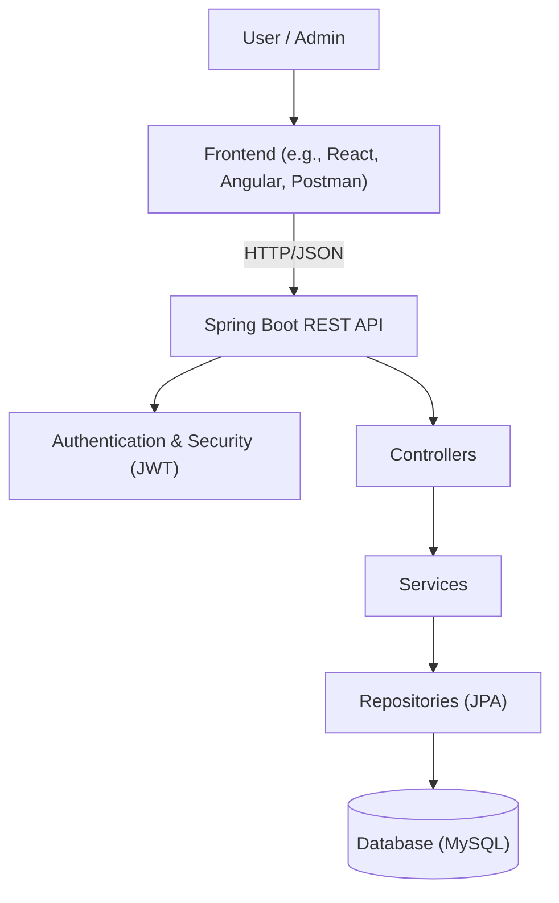

# Movie Reservation System

A full-featured Movie Reservation System built with Java, Spring Boot, and JPA. This application allows users to browse movies, view showtimes, reserve seats, and manage reservations. Admin users can manage movies, halls, showtimes, and seats.

---

## System Architecture Diagram



---

## Features
- User registration and authentication (JWT-based)
- Browse movies and showtimes
- Reserve seats for showtimes
- Admin panel for managing movies, halls, showtimes, and seats
- Role-based access control (admin/user)
- RESTful API with Swagger documentation

## Tech Stack
- **Backend:** Java, Spring Boot, Spring Security, Spring Data JPA
- **Database:** MySQL 
- **Build Tool:** Maven


## Getting Started

### Prerequisites
- Java 17 or higher
- Maven
- MySQL (or compatible database)

### Setup
1. **Clone the repository:**
   ```bash
   git clone <repo URL>
   cd Movie-Reservation-system/movie_reservation_system
   ```
2. **Configure the database:**
   - Edit `src/main/resources/application.properties` with your DB credentials.
3. **Build the project:**
   ```bash
   mvn clean install
   ```
4. **Run the application:**
   ```bash
   mvn spring-boot:run
   ```
5. **Access the API docs:**
   - Swagger UI: [http://localhost:8080/swagger-ui.html](http://localhost:8080/swagger-ui.html)

## API Overview
- **Authentication:** `/api/auth/*`
- **Movies:** `/api/admin/movies/*` (admin), `/api/public/movies/*` (public)
- **Halls:** `/api/admin/halls/*` (admin)
- **Showtimes:** `/api/admin/showtimes/*` (admin), `/api/public/showtimes/*` (public)
- **Reservations:** `/api/user/reservations/*` (user)
- **Seats:** `/api/admin/seats/*` (admin)


## Database Design
- **Entity Relationship Diagram:** See [`Documentation/ERD.png`](Documentation/ERD.png)
- **SQL schema:** [`Documentation/drawSQL-mysql.sql`](Documentation/drawSQL-mysql.sql)

## Authentication & Security
- JWT-based authentication
- Role-based access control (`ADMIN`, `USER`)
- Secure endpoints for admin operations

## Contributing
Pull requests are welcome! For major changes, please open an issue first to discuss what you would like to change.

## License
[MIT](LICENSE) 

## Contact
For questions or support, please contact [maiatef066@gmail.com](/4z3581FNS9um6-e1IaqaJQ). 
